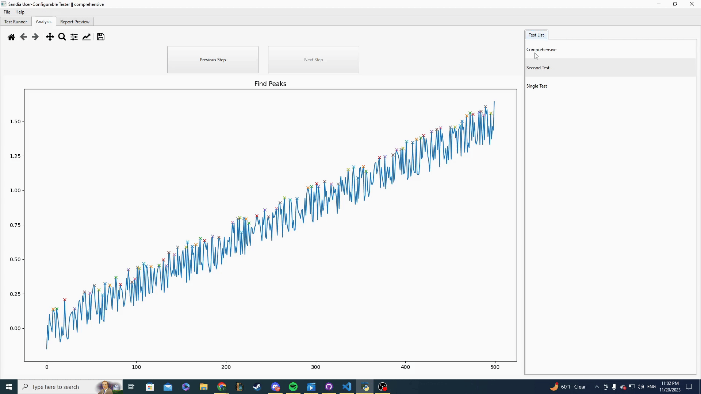

# Sandia User-Configurable Tester

## Description

Our team built a reconfigurable electronics product tester that can interface with DAQs from National Instruments. The tester can control and automate data acquisition and test sequencing when a DAQ is connected. Users can generate a report after running a test suite of configured tests. The main features are the following:

- Data collection: The nidaqmx API is used to interact with devices with NI-DAQmx drivers.
- Test configuration: The sequence of tests to be run in a test suite, as well as their accompanying parameters, can be saved to and loaded from a file.
- Signal processing: While running the tests, their results are graphically displayed along with useful metrics.
- Report generation: The report includes the pass/fail status of each test and a breakdown of the steps in each test. The output formats are json and pdf. [sample_report.json](demo/sample_report.json) and [sample_report.pdf](demo/sample_report.pdf) are included as examples.

## Overview

### Test Runner

In the Test Runner Tab, the user can select the device and its input and output channels, create test configurations in the "Configuration" side tab, and select which configurations are used in the "Test Suite" side tab. The nav bar holds buttons for starting/stopping the tests and options for viewing the graph.


### Analysis

The Analysis Tab shows the graphs for the individual test steps of the tests that were run.



### Report Preview

In the Report Tab, the user can generate the reports and set the passing threshold, which is the number of tests that need to pass for the entire test suite to pass.


## Installation

```

git clone https://github.com/Ulidtsoa01/Sandia-User-Configurable-Tester.git

cd Sandia-User-Configurable-Tester

pip install -r requirements.txt

```

## Steps for Running

Run `python app.py`

To run a test suite, do the following:

1. Plug in an USB DAQ device and install its DAQ drivers.
2. Select the DAQ device and input/output channels.
3. Configure your test steps.
4. Order your test steps in the test suite.
5. Click “Start Test Suite”. Once all tests finish running, graphs for each test step are shown in the Analysis Tab.
6. In the Report Tab, fill out each field (Custom Field allows you to populate a row in the report header with a custom title).
7. Select the output format (JSON or PDF).

## File Structure

- app.py imports from daq.py, signal_analysis.py, report.py
- Config files: app.py reads from init.cfg and a user-named config file (default.cfg by default). app.py can also create multiple config files.
- Report files: report.py creates user-named report files in the .json and .pdf format
